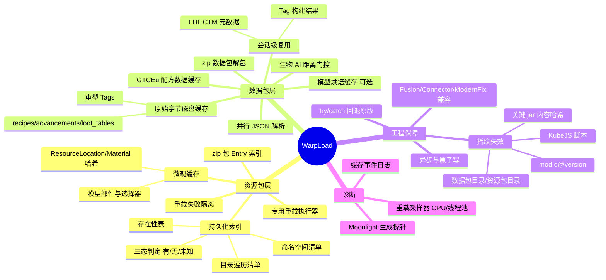
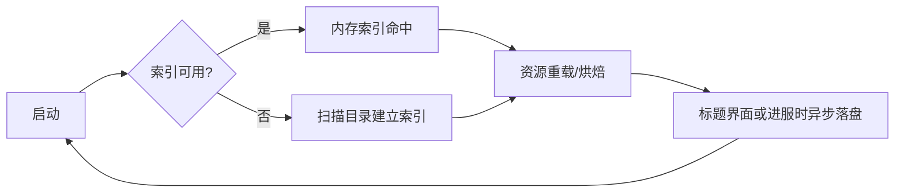

# WarpLoad

**MineRealmsPowered 出品** · Produced by **MineRealmsPowered**

> Minecraft **1.20.1 Forge** 启动 / 资源重载加速模组，面向大型整合包。
> An opinionated startup & resource-reload accelerator for heavy Minecraft 1.20.1 Forge modpacks.

WarpLoad 将"资源包与数据包的查找、解析、烘焙"从**每次启动重算**改为**一次计算、多次复用**，并以指纹控制失效、以失败隔离保证永不因优化而崩溃。
项目由 **Lightspeed**（LGPL-3.0，资源索引与重载加速的奠基工作）与 **OptiLoad**（磁盘缓存与数据包解包思路）合并重写而来，并持续吸收 **GTOCore/GTOLib** 等实现的可用经验。

---

## 功能总览（思维导图）

---

## 技术原理

四条设计红线（按优先级）：

1. **绝不崩游戏** —— 所有快速路径 try/catch 兜底，异常即回退原版语义；
2. **绝不返回错误资源** —— 缓存与快速路径必须可证明等价，不确定时放弃优化；
3. **不做有损缓存** —— 只缓存可无损重建的对象（原始字节、路径清单、构建结果）；
4. **环境自适应** —— 检测 Fusion / Connector / ModernFix / KubeJS 等，按包、按实例降级。

### 1. 资源包层：持久化索引 + 三态判定

每个模组资源包维护三类索引（`warpload-cache/v1/*.ser`，经 Java 序列化落盘）：

| 索引 | 内容 | 用途 |
|---|---|---|
| 命名空间 | `PackType → [namespace]` | 跳过目录探测 |
| 路径清单 | `PackType + namespace → [相对路径]` | `listResources` 直接内存枚举 |
| 存在性 | `路径 → 是否存在` | `getResource` 命中/未命中直接判定 |

查询采用**三态判定**：`有` → 直接打开；`无` → 直接返回空；`未知` → 回退原版并顺带补建索引。
索引在启动期异步预载，并在**标题界面或进服/进世界时统一落盘**（quickplay、直连服务器同样生效）。

### 2. 数据包层：原始字节缓存

- **JSON 重载缓存**：仅落盘**原始字节**（无损），下次直接喂解析器；无缓存时并行解析；
- **Tag 缓存**：条目级磁盘缓存 + **同会话构建结果复用**（原始条目指纹门控，改动即重建）；
- **zip 数据包解包**：解包为目录包（`world/warpload_cache/<sha1>`，size+mtime 校验），从"随机读 zip"变为"可索引路径包"；
- **模型烘焙缓存**（默认关）：跳过整个烘焙循环，按内存上限保护。

### 3. 集成：GTCEu 配方数据缓存

在格雷科技动态数据包生成入口拦截，将其生成的约 **6.4 万条配方原始 JSON** 捕获落盘；后续启动直接回注并跳过重算（含 Composter/材料数据等副作用补跑）。
指纹由 `KubeJS 监听状态 + GT 配置内容哈希 + 环境版本` 组成，稳定后二次启动命中。

### 4. 失效控制：指纹体系

| 层级 | 指纹构成 |
|---|---|
| 全局 | `modId@version` 排序 + **关键 mod jar 内容 SHA-256** + KubeJS 脚本目录 + 数据包目录条目 |
| 单目录 | 上述 + 目录名 |
| 资源包索引 | `moduleName + version + 文件名 + jar size/mtime` |
| LDL CTM | 全局指纹 + `resourcepacks/` 目录条目 |

任何指纹变化只导致对应缓存 **MISS 重建**，绝不脏读；写入均为**临时文件 + 原子替换**。

### 5. 运行时机制

- 专用 work-stealing 重载执行器（并行度可配），替代共享工作池；
- 单监听器失败隔离：一个坏 mod 的 reload listener 不再拖垮整个加载流程；
- 软引用内存缓存，重载/进服后释放，不与游戏争内存。

---

## 配置（`config/warpload-common.toml` 摘要）

| 键 | 默认 | 说明 |
|---|---|---|
| `enabled` | true | 总开关 |
| `startup.asyncPreloadPacks` | true | 启动期预载资源索引 |
| `startup.dedicatedResourceReloadExecutor` | true | 专用重载池 |
| `startup.reloadWorkers` | 0 | 重载池并行度（0 = 自动，核数-2） |
| `startup.parallelResourceLookup` | false | 并行包查找（实测负优化，默认关） |
| `startup.parallelJsonParsing` | true | 并行 JSON 解析 |
| `reloadCache.jsonReloadCacheEnabled` | true | JSON 磁盘缓存 |
| `reloadCache.tagReloadCacheEnabled` | true | Tag 磁盘缓存 |
| `reloadCache.reuseBuiltTags` | true | 同会话复用已构建 Tag 集合（条目指纹门控） |
| `reloadCache.contentHashedMods` | `["gtceu"]` | 参与内容哈希的 mod（同版本换 jar 也能失效） |
| `datapack.extractZipDatapacks` | true | 解包 zip 数据包 |
| `modelCache.modelBakeCacheEnabled` | false | 模型烘焙缓存 |
| `ai.aiOptimizationEnabled` | true | 生物 AI 距离门控 |
| `integration.gtRecipeDataCache` | true | GTCEu 配方数据缓存 |
| `client.ldlCtmCache` | true | LowDragLib CTM 元数据缓存（仅装 ldlib 时生效） |
| `debug.reloadTimeline` / `debug.moonlightProbe` | true | 诊断日志（可关） |

---

## 实测观察

> 环境：某 300+ mod 大型整合包（GTCEu 7.5.3、KubeJS、Moonlight 系、TC4 移植版等），E5-2697 v2 / 32GB。数据来自真实启动日志，受磁盘与网络波动影响。

**启动 / 进服对比**（冷索引 = 清空全部缓存后的首次启动；热索引 = 缓存已落盘）

| 场景 | 启动 → Sound engine | 动态资源生成总计 | 进服阶段（Connecting → 就绪） | kubejs:jei |
|---|---|---|---|---|
| 无 WarpLoad | 262s | ~4.8s | 90s | 2.37s |
| 1.1.5 热索引（直连服务器） | **230s** | **4.18s** | **79s** | 1.99s |
| 1.1.7/1.1.8 冷索引（quickjoin 直连） | 312–315s | 10.7s | 78–82s | 1.82–1.89s |

**动态资源生成与"并行查找"实验**（同一整合包，同一套生成任务）

| 配置 | 全部生成 | 最慢单项（supplementaries） |
|---|---|---|
| 无 WarpLoad（参照） | ~4.8s | 0.78s |
| 并行包查找开启 | 10.35s | 7.90s |
| 并行包查找关闭（现行默认） | **4.18s** | **1.45s** |
| 冷索引（清缓存后首启） | 10.7s | 8.5–8.7s |

结论与说明：

- **并行包查找在索引就绪后是负优化**：查找本身已是 O(1) 内存命中，再对每个包派发任务只会把"海量小读取"拖慢约 10 倍（上表 7.90s → 1.45s），因此默认关闭（`startup.parallelResourceLookup = false`）。
- **冷索引的代价是一次性的**：清空缓存后的首次启动需要重建全部索引与生成素材（~8.7s/项），落盘后的后续启动恢复 1.4s 级；
- **第三方卡死不再放大**：JEI 插件深扫（TC4 移植版的要素推导）在现行版本中未再阻塞主线程（kubejs:jei 阶段 ≤2s）；
- 缓存在**标题界面或进服/进世界时落盘**（quickplay 与直连服务器均生效），缓存目录实测约 1264 文件 / 21MB。

---

## 构建

- 需要 JDK 17：`./gradlew build`
- GT 集成部分编译需要 `libs/gtceu-1.20.1-7.5.3.jar`（自行从 GTCEu 发行渠道获取后放入 `libs/`；该文件不随仓库分发）

## 致谢与许可

- 基于 **Lightspeed** by CCr4ft3r & kltyton（LGPL-3.0）
- 参考 **OptiLoad** by NeoFastFTL（反编译研究）
- 思路借鉴 **GTOCore / GTOLib**（原始字节缓存、内容指纹、异步写盘、对象级复用）
- 本项目以 **LGPL-3.0** 发布

**MineRealmsPowered 出品**
